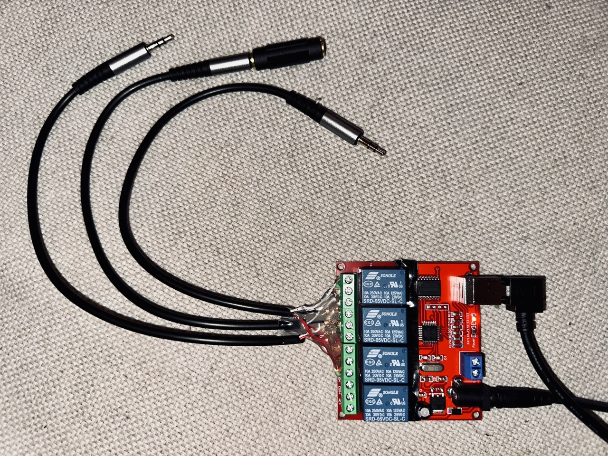

# dac-abx-test
AB test two DACs to see if you can tell the difference

## Hardware
This code uses the Python `pyhid_usb_relay` package to control a relay board that routes sound from your DACs to your headphones. You need a 4-channel relay that exposes an HID interface. This was only tested on macOS but should work on other operating systems, too.

I used [this relay](https://www.amazon.com/gp/product/B08CS9MMD6/ref=ppx_yo_dt_b_asin_title_o07_s00?ie=UTF8&psc=1) with [these stereo connectors](https://www.amazon.com/gp/product/B0BRCSZ82D/ref=ppx_yo_dt_b_asin_title_o09_s00?ie=UTF8&psc=1), though it's not hard to find a number of similar options. Some quick notes:

- The relay I bought appeared to work without external power, but did not switch the relays correctly. Although the Amazon listing said 5V, my board needed 12V to get it to function correctly. I found it helpful to use a multimeter to test for relay switching.
- I taped over the status LEDs of the relay so I could not see which DAC I was listening to if I looked.
- When putting the wires into the relay, put the ground wire in the center relay and cut its length slightly since the distance to the center relay is lower than the distance to the outer relays.
- As you can see I used hot glue to help everything stay in place. Make sure the exposed ground wires to not short.

## One last step before the fun begins!

Before starting your AB test, you need to make sure the volume coming from each DAC is the same. To do this:

- Plug both DACs into your computer via USB
- Set up your computer to output sound to both devices at the same time (in macOS, use Audio MIDI Setup — Google for instructions)
- Choose a volume level you like using one of the DACs
- Play a sine wave from your computer (in macOS, `play -n synth sin 440 sin 440 channels 2`)
- Put a ~300 ohm resistor between ground and one of the channel wires on a stereo plug, and measure the voltage drop across it with a multimeter. Move it to the other DAC and adjust its volume to match that voltage.

## Software

Running this code should be very straightforward. `pip install pyhid_usb_relay` and then run the included Python script.

The code is currently configured to do ten rounds. In each round, DACs will be assigned "X" or "Y" randomly. You can press "Enter" to toggle between them as many times as you'd like as you play music, and when you've decided which you like best, just press "X" or "Y" (or "x" / "y") and then Enter to move onto the next round. Which DAC is "X" and which is "Y" changes from session to session.

(This is slightly different from the UX of a typical ABX test. I think it's a little simpler and more intuitive.)

At the end of ten rounds your votes are tallied!
